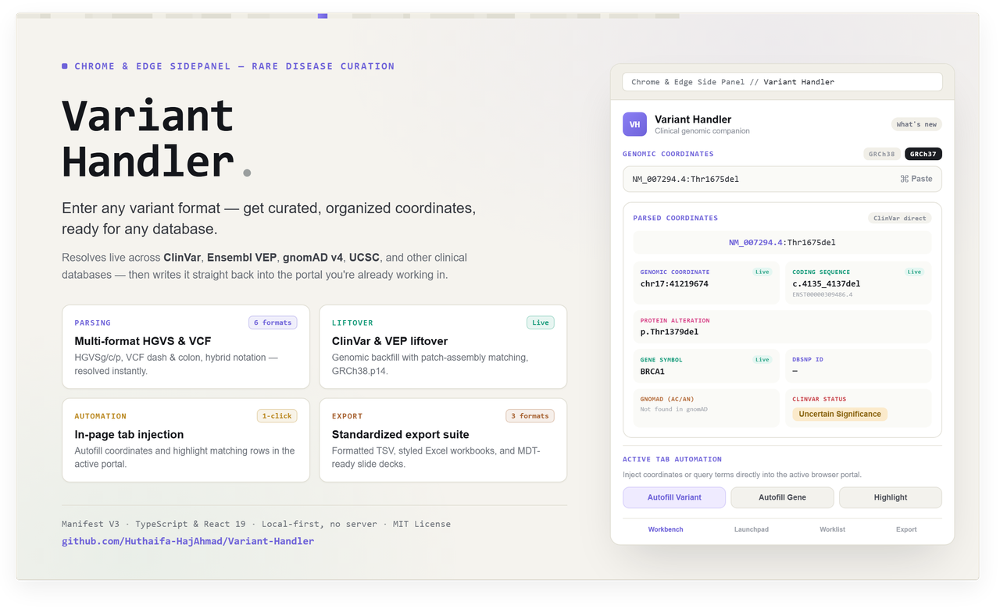

<div align="center">

# 🧬 Variant Handler



**A stateful Chrome sidebar extension for clinical genomic coordinate parsing, and cross-portal navigation.**

[](https://www.typescriptlang.org/)
[](https://react.dev/)
[](https://developer.chrome.com/docs/extensions/mv3/intro/)
[](./src/__tests__/parser.test.ts)

</div>

---

## What It Is

Variant Handler is a Chrome extension that lives in the browser's side panel. It solves a real workflow problem in clinical genomics: scientists cross-reference patient variants across multiple web databases (gnomAD, ClinVar, UCSC, SpliceAI, VariantValidator, and others), each of which demands a different coordinate format — VCF dash notation, HGVSg, HGVSc, or raw coordinates. Copying and reformatting between tabs is error-prone and time-consuming.

Variant Handler acts as a **persistent, format-aware clipboard** that travels across all those tabs. Paste a variant once in any format; the extension parses it, resolves coordinates, and autofills the correct format into whichever database you open next.

---

## Scope & Intended Use

**Variant Handler is designed for rare-disease (germline) genomics workflows.** The parser and enrichment layer are oriented toward constitutional variants reported in HGVS nomenclature.

### Variant classes supported

| Class | Supported? | Notes |
|-------|-----------|-------|
| **SNVs** (single nucleotide) | ✅ Full | Primary use case — HGVSg, VCF dash, simple `chr:posREF>ALT`, HGVSc, HGVSp all parse and launch to every platform. |
| **Small indels** (≤ a few kb del/ins/dup/delins/inv at sequence level) | ✅ Full | HGVS `del`/`ins`/`dup`/`delins`/`inv` with explicit sequence or ranges parse. Lacking sequence (e.g., range deletions or duplications) is resolved via the UCSC Sequence API (during live enrichment) to construct standard VCF alleles and enable launches. |
| **CNVs / copy-number** (cytogenetic `del(17)(p13.1)`, MLPA "del exon 7–10", large-scale gains/losses) | ❌ Not supported | No parser, no platform integration (no gnomAD CNV, ClinGen dosage, or DECIPHER CNV viewer) |
| **Translocations / fusions** (`t(9;22)(q34;q11)`, fusion transcripts) | ❌ Not supported | |
| **RNA-level** (`r.76a>u`) | ❌ Not supported | |
| **Multi-allelic / complex** (`[c.123A>T;c.456G>C]`, uncertain positions `c.(100_200)A>T`) | ❌ Not supported | |

### Oncology / somatic data — important caveat

The extension is **not built for somatic (oncology) workflows**. Specifically:

- **No germline/somatic distinction.** The parser treats every input as a constitutional variant. There is no tumour/normal pairing, no variant allele frequency (VAF) handling, and no somatic-specific notation parsing.
- **Enrichment has poor somatic coverage.** The Live Lookup source (MyVariant.info) is curated primarily for **germline** variants. Well-characterised somatic variants (e.g., `BRAF c.1799T>A` / V600E, `EGFR` exon 19 deletions) may return empty or partial annotation, and no COSMIC / OncoKB /cIViC integration exists.
- **Why oncology genes appear at all.** The bundled gene-symbol table (`src/lib/geneSymbols.ts`) includes `BRCA1/2`, `TP53`, `BRAF`, `KRAS`, `EGFR`, `PTEN`, and the Lynch genes (`MSH2/6`, `MLH1`, `PMS2`). These overlap hereditary cancer-predisposition (germline, in scope) with somatic oncology markers (out of scope). Their presence enables gene-symbol backfill for hereditary cancer panels, **not** somatic analysis.

**Recommendation:** For pure oncology/somatic reporting (VAF, COSMIC, OncoKB, tumour-board workflows), use a somatic-focused tool. Variant Handler can *parse and navigate* the notation for an oncology variant you paste, but it will not surface somatic-relevant annotation and should not be relied on for somatic clinical interpretation.

---

## Feature Overview

### 🔬 Real-Time Genomic Parser
Accepts any variant notation and extracts structured fields (chromosome, position, ref, alt, transcript, coding change, protein change) client-side. Optional live lookups backfill missing annotations from public APIs.

**Supported input formats:**

| Format | Example |
|--------|---------|
| HGVSg (with/without `chr` prefix) | `chr7:g.140753336A>T`, `7:g.140753336A>T` |
| VCF dash/colon | `7-140753336-A-T`, `12:25245350:C:T` |
| Simple coordinate+change | `chr12:25245350C>T` |
| Coordinate-only | `chr17:43044295` |
| HGVSc transcript:coding | `NM_000492.4:c.1521_1523delCTT` |
| ENST coding | `ENST00000288602:c.1799T>A` |
| Hybrid (coding + protein) | `NM_000277.3:c.1222C>T(p.Arg408Trp)` |
| HGVSp protein | `p.Arg408Trp`, `p.Phe508del`, `p.Gln1756fs`, `p.Arg54*`, `p.(Phe508del)` |
| NC_ genomic accession | `NC_000007.14:c.117559590A>G` → infers chr7 |
| Mitochondrial | `NC_012920.1:c.1555A>G` → infers chrMT |

### 🌐 Live Coordinate & Sequence Resolution (Layered Enrichment)
Genomic coordinates and sequences are resolved at runtime via a layered enrichment backend:
1. **UCSC Sequence API** — fetches reference genome sequence data to resolve VCF-conforming coordinates and alleles for structural variants lacking explicit sequence.
2. **MyVariant.info** — rsID, gnomAD AF, ClinVar snapshot, gene/HGVSc (fast cached path)
3. **ClinVar E-utilities direct** — current ClinVar significance/review (no lag), dbSNP rsID, build-correct coordinates for both GRCh38 + GRCh37
4. **Ensembl VEP** — gene/HGVSg with true left-aligned alleles; GRCh38→GRCh37 liftover

Disable Live Lookup in Settings for sensitive/unpublished variants — parsing and URL-building work fully offline.

### 🚀 Platform Launchpad
One-click launch to 8 partner databases with automatic format translation:

| Database | Format Used |
|----------|-------------|
| gnomAD Browser | `chrom-pos-ref-alt` (VCF dash) |
| UCSC Genome Browser | `chrN:start-end` (correct range for indels) |
| SpliceAI Lookup | `chrN-pos-ref-alt` |
| AlphaMissense | Raw input (custom search) |
| ClinVar (NCBI) | Raw input (search term) |
| dbSNP (NCBI) | Raw input (search term) |
| Mutalyzer | Raw input (HGVS checker) |
| VariantValidator | HGVSc `transcript:c.change` |

Buttons are disabled with a descriptive tooltip when the active variant is missing required fields for that platform (e.g., VariantValidator requires a transcript accession).

### 📋 Batch Worklist Queue
- Persistent queue stored in `localStorage`; survives browser restart
- Free-text clinical annotation notes with auto-save
- Keyboard shortcuts for panel navigation (see [Keyboard Shortcuts](#keyboard-shortcuts))
- Click any queued variant to load it instantly into the workbench

### 📜 Search History
- Automatically records validated variant searches with 600 ms debounce
- Only records inputs that parse successfully (no partial-entry noise)
- Capped at a configurable limit (default 100, selectable in Settings); individual entries can be cleared
- Persisted to `localStorage`

### 📤 Export Suite
Three export formats, all generated client-side:

| Format | Contents | Use Case |
|--------|----------|----------|
| **TSV** | Queue + history with all parsed fields (chr, pos, ref, alt, transcript, c., p.) | Import into Excel, R, Python |
| **XLS** | Styled HTML-based Excel workbook with color-coded significance badges | Clinical reporting |
| **Presentation** | Dark-theme HTML slide deck, one slide per variant, print-to-PDF ready | Case discussion, MDT meetings |

### 💉 Content Script Autofill
When you navigate to a supported database while the panel is open, a **"Autofill Variant"** button appears next to the site's search input. Clicking it:
1. Reads the active variant from extension storage
2. Reformats it for the specific site's expected notation
3. Injects it into the search field and fires `input`/`change` events to trigger SPA state updates

Supported sites: gnomAD, UCSC, SpliceAI, AlphaMissense, NCBI (ClinVar/dbSNP), Mutalyzer, VariantValidator.

---

## Getting Started

### Prerequisites
- Node.js 18+
- Google Chrome (or Chromium-based browser with extension support)

### Development Setup

```bash
# 1. Clone and install
git clone https://github.com/Huthaifa-HajAhmad/Variant-Handler.git
cd Variant-Handler
npm install

# 2. Run the side panel UI in dev mode (for rapid UI iteration)
npm run dev
# Open http://localhost:3000 in the browser

# 3. Build the full extension (side panel + content script + background worker)
npm run build

# 4. Load in Chrome
# → Open chrome://extensions
# → Enable "Developer mode" (top-right toggle)
# → Click "Load unpacked" → select the dist/ folder
```

### Running Tests

```bash
npm test           # Run all tests once
npm run test:watch # Watch mode
npm run test:ui    # Browser-based Vitest UI
```

### Type Checking

```bash
npm run lint       # Runs tsc --noEmit (zero warnings = clean)
```

---

## Project Structure

```
variant-handler/
├── public/
│   └── manifest.json          # Chrome MV3 manifest
├── src/
│   ├── background/
│   │   └── index.ts           # Service worker: opens side panel on toolbar click
│   ├── content/
│   │   └── index.ts           # Content script: autofill button injection
│   ├── sidepanel/
│   │   └── index.tsx          # Root side panel component (state orchestrator)
│   ├── components/
│   │   ├── VariantWorkbench.tsx    # Input form + parsed field display
│   │   ├── PlatformLaunchpad.tsx  # 8-platform button grid
│   │   ├── BatchQueuePanel.tsx    # Queue + history tabs + export buttons
│   │   ├── HighlightedCoordinate.tsx  # Syntax-coloured variant display
│   │   ├── Header.tsx             # Toolbar with theme toggle
│   │   ├── SettingsModal.tsx      # Theme picker + keyboard shortcuts
│   │   └── Footer.tsx
│   ├── hooks/
│   │   ├── useBatchQueue.ts    # Queue state + localStorage sync + validation
│   │   ├── useHistory.ts       # Debounced history recording
│   │   ├── useKeyboardShortcuts.ts  # Alt+key global shortcuts (ref pattern)
│   │   └── useTheme.ts         # Theme selection + light/dark toggle
│   ├── lib/
│   │   ├── parser.ts           # 🧠 Core genomic parser + platform URL builder
│   │   ├── portals.ts          # Optional CLINICAL_PRESETS platform adapters
│   │   ├── themes.ts           # Color theme definitions
│   │   └── types.ts            # Shared domain types (BatchItem)
│   ├── utils/
│   │   ├── exporters.ts        # TSV / XLS / PPT export generators
│   │   ├── sanitize.ts         # escapeHtml, isSafeUrl, downloadBlob
│   │   └── variantUtils.ts     # inferGeneLabel (with transcript lookup)
│   └── __tests__/
│       ├── parser.test.ts      # parser, URL builder, edge cases
│       └── enrichment.test.ts  # deriveQueryKey + parseApiResponse (RCV ranking)
├── doc/
│   ├── PRD.md                  # Product requirements document
│   ├── features.md             # Integration reference
│   └── ARCHITECTURE.md         # (this audit) system design notes
├── .gitattributes              # Enforces LF line endings across all platforms
├── tsconfig.json
├── vite.config.ts
└── vitest.config.ts
```

---

## Architecture

### Parsing Pipeline

Every variant string passes through a 4-stage pipeline inside [`parseVariant()`](./src/lib/parser.ts):

```
Raw input string
      │
      ▼
Stage 1: Genomic regex battery (HGVSg / VCF / coordinate-only)
      │ ─── if match ──► extract chrom, pos, ref, alt
      │
Stage 2: HGVSc regex (transcript:c.change)
      │ ─── if match ──► extract transcript, codingChange [+ protein if hybrid]
      │                  infer chrom from NC_ accession if present
      │
Stage 3: HGVSp regex (protein-only or transcript:protein)
      │ ─── if match ──► extract proteinChange [+ transcript]
      │
Stage 4: Gene-symbol backfill (GENE_TO_DEFAULT_TRANSCRIPT)
          ─── gene-prefixed inputs (PAH:c.1222C>T) get a default transcript
          ─── genomic coordinates for transcript-only inputs are resolved
              at runtime by the enrichment layer (ClinVar direct + Ensembl VEP),
              not by a static table (R1: canonical hotspot DB removed)
```

The result is a `ParsedVariant` object with full diagnostics log.

### URL Building

[`buildPlatformUrl()`](./src/lib/parser.ts) translates a `ParsedVariant` into a platform-specific URL using named template placeholders:

| Placeholder | Value |
|-------------|-------|
| `{{chrom}}` | Chromosome (percent-encoded) |
| `{{pos}}` | Start position |
| `{{endPos}}` | End position (= start + max(ref,alt).length − 1 for indels) |
| `{{ref}}` / `{{alt}}` | Alleles (percent-encoded) |
| `{{variant}}` | Raw input (percent-encoded) |
| `{{c}}` | Full HGVSc string |
| `{{g}}` | Full HGVSg string |

[`getMissingDataReason()`](./src/lib/parser.ts) validates format requirements per platform before building, returning a human-readable message if data is insufficient.

### Extension Messaging

```
Side Panel (index.tsx)
    │  chrome.storage.local.set({ variantstream_active_input: ... })
    │  chrome.storage.local.set({ variantHandlerPanelOpen: true/false })
    │
    ▼
Content Script (content/index.ts)
    │  chrome.storage.local.get('variantstream_active_input')
    │  chrome.storage.onChanged.addListener(...)
    │
    ▼
Host Page Input Field
    (native value setter + input/change events for SPA compatibility)
```

---

## Keyboard Shortcuts

All panel shortcuts use `Alt` + key and are disabled when a text field has focus.

| Shortcut | Action |
|----------|--------|
| `Alt + S` | Toggle Settings modal |
| `Alt + N` | Focus the analysis notes textarea |
| `Alt + V` | Open the Variant Handler side panel (global Chrome command) |

---

## Security Model

| Concern | Mitigation |
|---------|-----------|
| XSS in HTML exports | All user strings pass through `escapeHtml()` before embedding in XLS/PPT |
| URL injection | `isSafeUrl()` enforces `https:` only; all URL params are `encodeURIComponent`-encoded |
| `javascript:` URIs | `isSafeUrl()` rejects non-https schemes; `window.open` uses `noopener,noreferrer` |
| Phishing via alert() | Content script uses non-blocking toast notifications instead of `alert()` |
| Malformed localStorage | `parseBatchItem()` validates each item shape on read |
| Third-party favicon/telemetry leak | Platform buttons use local first-letter colored circles — no external favicon or analytics requests |
| Cross-build coordinate mismatch | Chromosome-length bounds validator warns when a position exceeds the selected build's max; ClinVar direct supplies build-correct coords; Ensembl liftover runs during enrichment |
| Reference allele mismatch | Live enrichment queries UCSC Sequence API to validate ref alleles; warning banners alert users of mismatches |
| Sensitive genomic data at rest | Enrichment cache in `chrome.storage.session` (cleared on browser close); queue/history behind "Clear data on close" toggle + "Clear all stored data" action |
| CSP | Manifest `script-src 'self'; object-src 'none'; connect-src` limited to UCSC Sequence API, MyVariant, Ensembl, and NCBI E-utilities |

---

## Permissions

The extension requests the minimum required permissions:

| Permission | Reason |
|------------|--------|
| `sidePanel` | Open the side panel via toolbar click |
| `storage` | Persist queue, history, theme, and genome-build preference in `chrome.storage.local` |
| Host permissions (7 domains) | Inject content script to autofill search inputs on supported clinical databases |

All coordinate parsing is performed locally. The extension optionally queries public clinical APIs (UCSC Sequence API, MyVariant.info, Ensembl, and NCBI) over HTTPS to fetch annotation enrichments if live lookup is enabled in Settings.

---

## Themes

Three built-in color themes, switchable from the Settings modal or with the sun/moon toggle in the header:

| Theme | Appearance |
|-------|-----------|
| **Slate Dark** (default) | Deep slate background, indigo accents |
| **Slate Light** | Clean white background, indigo accents |
| **Emerald Dark** | Zinc background, emerald accents |

Theme preference is saved to `localStorage` and restored on next open.

---

## Development Notes

### Adding a New Platform

1. Add an entry to `INITIAL_PLATFORMS` in [`src/lib/platforms.ts`](./src/lib/platforms.ts).
2. Set `requiredFormat` to one of: `'dash' | 'hgvs_g' | 'hgvs_c' | 'coordinate' | 'custom'`.
3. If the platform requires custom URL generation logic (e.g., gnomAD or ClinVar), implement a `PlatformUrlBuilder` in [`src/lib/urlBuilders.ts`](./src/lib/urlBuilders.ts) and register it in the `builders` Map. Otherwise, URL generation will fall back to replacing template placeholders specified in `urlTemplate`.
4. Add the domain to `host_permissions` and `content_scripts.matches` in [`public/manifest.json`](./public/manifest.json).
5. Add a domain-specific input selector to `findSearchInput()` in [`src/content/index.ts`](./src/content/index.ts) if the generic heuristic doesn't find the right field.

### Coordinate Resolution (no static hotspot table)

The canonical hotspot database was removed (R1) — the parser is strictly notation-based. Genomic coordinates for transcript-only inputs are resolved at runtime by the enrichment layer (`src/hooks/useVariantEnrichment.ts`), which queries ClinVar E-utilities (`src/lib/clinvarDirect.ts`) and Ensembl VEP for build-correct, left-aligned coordinates. To add a new enrichment source, add a function to `clinvarDirect.ts` (or a new `src/lib/<source>Direct.ts`) and merge its result in `fetchEnrichment`.

### Adding a Gene Symbol

Add the `accession → symbol` mapping to `TRANSCRIPT_TO_GENE` in [`src/utils/variantUtils.ts`](./src/utils/variantUtils.ts).

---

## Supported Browsers

| Browser | Status |
|---------|--------|
| Google Chrome 114+ | ✅ Full support (Manifest V3 + Side Panel API) |
| Microsoft Edge 114+ | ✅ Compatible (Chromium-based, same APIs) |
| Firefox | ❌ No Side Panel API support in MV3 |
| Safari | ❌ No Side Panel API support |

---

## AI-Assisted Development

This project was developed with AI assistance and validated against a comprehensive suite of 140+ unit tests to ensure parsing accuracy and safety.

---

## Contributing

Contributions are welcome! Please read [`CONTRIBUTING.md`](./CONTRIBUTING.md) to get started with setting up the project locally, running tests, and submitting changes.

---

## License

This project is licensed under the MIT License - see the [`LICENSE`](./LICENSE) file for details.
